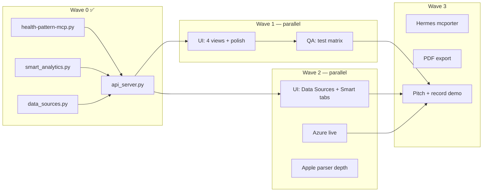

# VitaSide — Multi-Agent Orchestration

> **Conductor chat** (этот тред): держит волны, разрешает конфликты, мержит результаты.  
> **Worker chats**: один агент = один промпт из `plan/agents/`. Не переписывать чужую зону.

**Repo:** `vitaside-hackathon` (workspace root — use relative paths in agent prompts)

---

## Wave 4 — Audit hardening (2026-06-27 evening) ✅

| Lane | Status | Deliverable |
|------|--------|-------------|
| Skin safety | 🟢 | `skin_analysis.py` — ABCDE observations only; no risk_score |
| Privacy | 🟢 | Vault path: env → ~/Documents/Obsidian Vault → demo (no hardcoded user path) |
| Dependencies | 🟢 | pillow + python-multipart in requirements.txt; requirements-dev.txt |
| API skin upload | 🟢 | Form() consent, 15 MB limit, 400 on validation errors |
| Clinical framing | 🟢 | `observations_for_review` in clinical summary |
| UI skin section | 🟢 | DoctorHandoff: photo guide, errors, progress, no risk display |
| Plans sync | 🟢 | ROCKET-PLAN, TASKS, ROADMAP, README status dashboard |

**Gate:** `python3 test_mvp.py` green + manual skin API edge cases verified

---

## Depth Sprint Wave S1+S3 (2026-06-27) ✅

| Lane | Status | Deliverable |
|------|--------|-------------|
| Backend S1+S3 | 🟢 | `clinical_summary.py`, `n1_compare.py`, `fhir_export.py`, MCP tools, API |
| UI S5 | 🟢 | DoctorHandoff clinical summary, Smart N-of-1 card |
| Integration | 🟢 | `write-mcp-config.sh`, `docs/COLLABORATION.md`, mcporter depth tests |
| Azure S4 | ⚪ | Live enhance — stub OK for demo |

**Gate:** `python3 test_mvp.py` + `bash test-mcporter.sh` + `cd ui && npm run build`

---

## Status board (2026-06-27 — all hackathon lanes closed)

| Lane | Agent prompt | Status | Notes |
|------|--------------|--------|-------|
| UI Dashboard | `agents/01-UI-AGENT.md` | 🟢 Done | 6 tabs, skin section hardened Wave 4 |
| Backend / Smart | `agents/02-BACKEND-AGENT.md` | 🟢 Done | 30+ MCP tools, clinical layer |
| Azure hybrid | `agents/03-AZURE-AGENT.md` | ⚪ Stub | Live needs credentials — OK for demo |
| QA / Hardening | `agents/04-QA-AGENT.md` | 🟢 Done | Waves 1–4 in QA-REPORT |
| Pitch / Demo | `agents/05-PITCH-AGENT.md` | 🟢 Done | DEMO-SCRIPT + preflight |
| Hermes / MCP | `agents/06-INTEGRATION-AGENT.md` | 🟡 Simulation | mcporter 15/15; live Hermes = backlog |

Legend: 🟢 done · 🟡 partial / human step · ⚪ not started · 🔴 blocked

**Next human actions:** real vault (`OMI_VAULT_PATH`), Apple export, doctor feedback — see `DEPTH-ROADMAP.md` D1.

---

## Dependency graph



---

## Waves (sequential gates, parallel inside wave)

### Wave 0 — Foundation ✅
- MCP 1.1, smart analytics, narrative engine, data_sources catalog
- `api_server.py`: briefing, timeline, smart, data-sources, mechanics
- UI scaffold: Dashboard, Timeline, Condition, DoctorHandoff
- `test_mvp.py` — 36 checks

**Gate:** `python3 test_mvp.py` green

---

### Wave 1 — Demo-ready surface ✅

**Gate passed:** `./serve-ui.sh` + `test_mvp.py` + `./run-demo-full.sh --hardening`

---

### Wave 2 — Depth for judges ✅

| Track | Deliverable | Status |
|-------|-------------|--------|
| **UI+** | Data Sources, Smart tabs | ✅ |
| **Azure** | Contract + stub demo | ✅ stub |
| **Apple** | SpO2, sleep stages in merge | ✅ partial |

---

### Wave 3 — Wow & ship ✅

| Track | Deliverable | Status |
|-------|-------------|--------|
| **Integration** | `test-mcporter.sh` 15/15, config scripts | ✅ |
| **PDF** | print CSS | ⚪ backlog |
| **Pitch** | DEMO-SCRIPT + preflight | ✅ |

---

### Wave 4 — Audit hardening ✅ (2026-06-27 evening)

Skin safety, privacy paths, requirements, plan sync. See top of this doc.

---

### Wave 5 — Real data (human, post-hackathon) ⚪
- Real `OMI_VAULT_PATH`, Apple export, doctor feedback

---

## File ownership (avoid merge hell)

| Path | Owner |
|------|-------|
| `code/health-mcp-starter/ui/**` | UI agent |
| `code/health-mcp-starter/api_server.py` | UI agent (thin) OR conductor only |
| `code/health-mcp-starter/health-pattern-mcp.py` | Backend agent |
| `code/health-mcp-starter/smart_*.py`, `data_sources.py`, `narrative_engine.py` | Backend agent |
| `code/health-mcp-starter/azure_*.py` | Azure agent |
| `code/health-mcp-starter/test_*.py`, `run-demo-full.sh` | QA agent |
| `pitch/**`, `docs/index.html` | Pitch agent |
| `plan/**` | Conductor |

**Rule:** New JSON helpers in `api_server.py` OK; no duplicate parsing in UI.

---

## Conductor checklist (each sync)

1. Run `python3 test_mvp.py` — must stay green
2. Check git diff boundaries (UI didn't touch MCP core)
3. Update status board above
4. Assign next wave only when gate passes
5. Copy relevant API contract snippets into agent prompt if API changed

---

## Quick spawn (new Cursor chat)

```
Read plan/agents/0X-....md and execute your lane only.
Repo: .../vitaside-hackathon
Report: what changed, how to verify, blockers for conductor.
```

---

## API contract (shared — all agents)

| Endpoint | Consumer |
|----------|----------|
| `GET /api/briefing` | Dashboard |
| `GET /api/timeline` | Timeline |
| `GET /api/smart` | Smart / Attention panel |
| `GET /api/data-sources` | Data Sources tab |
| `GET /api/analysis-mechanics` | How it works (optional) |
| `GET /api/narrative?locale=ru` | Narrative strip |
| `GET /api/sidecar` | Dashboard TTL |
| `GET /api/clinical-summary` | DoctorHandoff |
| `GET /api/n1-compare` | Smart |
| `GET /api/fhir-preview` | DoctorHandoff (optional) |
| `POST /api/export-bundle` | Doctor handoff |

Full example: `schemas/data-sources.example.json`

---

## Next actions (post-hackathon)

1. **Human** → real `OMI_VAULT_PATH` + Apple Health export (Wave 5)
2. **Backlog** → PDF export, Azure live, E2E skin tests (see `plan/README.md`)
3. **Conductor** → update `plan/README.md` when a backlog item ships
