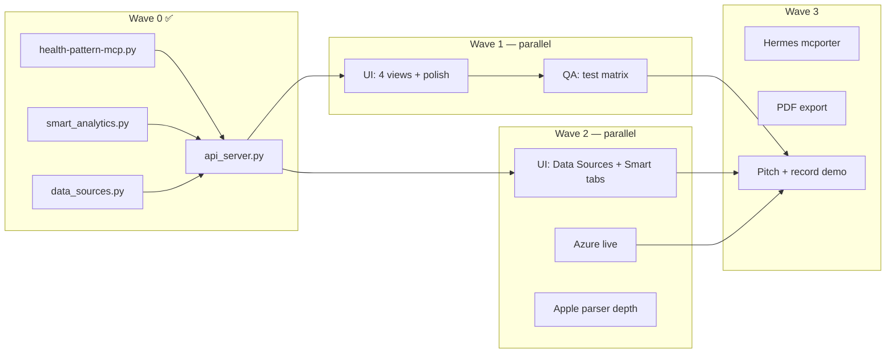

# VitaSide — Multi-Agent Orchestration

> **Conductor chat** (этот тред): держит волны, разрешает конфликты, мержит результаты.  
> **Worker chats**: один агент = один промпт из `plan/agents/`. Не переписывать чужую зону.

**Repo:** `/Users/dmitriibabinov/Documents/Aviato/05-hackathons/vitaside-hackathon`

---

## Depth Sprint Wave S1+S3 — parallel (2026-06-27)

| Lane | Status | Deliverable |
|------|--------|-------------|
| Backend S1+S3 | 🟢 | `clinical_summary.py`, `n1_compare.py`, `fhir_export.py`, FDR, MCP tools, API |
| UI S5 | 🟢 | DoctorHandoff clinical summary, Smart N-of-1 card |
| Integration | 🟢 | `write-mcp-config.sh`, `docs/COLLABORATION.md`, mcporter depth tests |
| Azure S4 | ⚪ | Live enhance (second agent) |

**Gate:** `python3 test_mvp.py` + `bash test-mcporter.sh` + `cd ui && npm run build`

---

## Status board (обновляет conductor)

| Lane | Agent prompt | Owner chat | Status | Blocker |
|------|--------------|------------|--------|---------|
| UI Dashboard | `agents/01-UI-AGENT.md` | [UI agent](0fe0ea45-f4c0-4485-b251-83f7b73429b3) | 🟢 6 tabs (Wave 2) | — |
| Backend / Smart | `agents/02-BACKEND-AGENT.md` | Backend (this) | 🟢 smart + data_sources | — |
| Azure hybrid | `agents/03-AZURE-AGENT.md` | Azure agent | ⚪ stub only | credentials |
| QA / Hardening | `agents/04-QA-AGENT.md` | [QA agent](7c8206c6-97e6-412e-8bd2-836ede2289a8) | 🟢 report + P0 fixes | — |
| Pitch / Demo | `agents/05-PITCH-AGENT.md` | Pitch agent | 🟡 script exists | UI in demo |
| Hermes / MCP | `agents/06-INTEGRATION-AGENT.md` | Integration | ⚪ simulation only | Hermes access |

Legend: 🟢 done · 🟡 in progress · ⚪ not started · 🔴 blocked

---

## Dependency graph



---

## Waves (sequential gates, parallel inside wave)

### Wave 0 — Foundation ✅
- MCP 1.1, smart analytics, narrative engine, data_sources catalog
- `api_server.py`: briefing, timeline, smart, data-sources, mechanics
- UI scaffold: Dashboard, Timeline, Condition, DoctorHandoff
- `test_mvp.py` — 36 checks

**Gate:** `python3 test_mvp.py` green

---

### Wave 1 — Demo-ready surface (NOW)

**Parallel tracks:**

| Track | Do | Don't |
|-------|-----|-------|
| **UI** | Acceptance from `01-UI-AGENT.md` + smoke `./serve-ui.sh` | Touch `health-pattern-mcp.py` logic |
| **QA** | Matrix: MCP + API + UI + scope leaks | Refactor prod code |

**Gate:** `./serve-ui.sh` + all UI acceptance + `test_mvp.py` + `./run-demo-full.sh --hardening`

**Wave 1 gate:** ✅ core + mcporter + scoped audit; `./serve-ui.sh` hardened for busy ports

---

### Wave 2 — Depth for judges

| Track | Deliverable |
|-------|-------------|
| **UI+** | Tabs: Data Sources, Smart/Attention (`/api/data-sources`, `/api/smart`) |
| **Azure** | Live `_call_openai` + share function OR documented stub demo |
| **Apple** | SpO2, sleep stages in `apple_merge.py` if time |

**Gate:** Demo script section 3–6 works with UI open on second screen

---

### Wave 3 — Wow & ship

| Track | Deliverable |
|-------|-------------|
| **Integration** | `test-mcporter.sh` green, Hermes config snippet |
| **PDF** | `export-for-doctor.sh --pdf` or print CSS |
| **Pitch** | 7-min script rehearsed, backup video |

**Gate:** Full dry-run 3× without errors

---

### Wave 4 — Real data (human, post-hackathon)
- Real `OMI_VAULT_PATH`, Apple export, doctor feedback

---

## File ownership (avoid merge hell)

| Path | Owner |
|------|-------|
| `code/health-mcp-starter/ui/**` | UI agent |
| `code/health-mcp-starter/api_server.py` | UI agent (thin) OR conductor only |
| `code/health-mcp-starter/health-pattern-mcp.py` | Backend agent |
| `code/health-mcp-starter/smart_*.py`, `data_sources.py`, `narrative_engine.py` | Backend agent |
| `code/health-mcp-starter/azure_*.py` | Azure agent |
| `code/health-mcp-starter/test_*.py`, `run-demo-full.sh` | QA agent |
| `pitch/**`, `docs/index.html` | Pitch agent |
| `plan/**` | Conductor |

**Rule:** New JSON helpers in `api_server.py` OK; no duplicate parsing in UI.

---

## Conductor checklist (each sync)

1. Run `python3 test_mvp.py` — must stay green
2. Check git diff boundaries (UI didn't touch MCP core)
3. Update status board above
4. Assign next wave only when gate passes
5. Copy relevant API contract snippets into agent prompt if API changed

---

## Quick spawn (new Cursor chat)

```
Read plan/agents/0X-....md and execute your lane only.
Repo: .../vitaside-hackathon
Report: what changed, how to verify, blockers for conductor.
```

---

## API contract (shared — all agents)

| Endpoint | Consumer |
|----------|----------|
| `GET /api/briefing` | Dashboard |
| `GET /api/timeline` | Timeline |
| `GET /api/smart` | Smart / Attention panel |
| `GET /api/data-sources` | Data Sources tab |
| `GET /api/analysis-mechanics` | How it works (optional) |
| `GET /api/narrative?locale=ru` | Narrative strip |
| `GET /api/sidecar` | Dashboard TTL |
| `GET /api/clinical-summary` | DoctorHandoff |
| `GET /api/n1-compare` | Smart |
| `GET /api/fhir-preview` | DoctorHandoff (optional) |
| `POST /api/export-bundle` | Doctor handoff |

Full example: `schemas/data-sources.example.json`

---

## Next actions (conductor assigns now)

1. **UI agent** → Wave 1 acceptance + Wave 2 Data Sources / Smart tabs  
2. **QA agent** → `plan/QA-REPORT.md` + fix gaps  
3. **Azure agent** → live or polished stub demo  
4. **Pitch agent** → add `./serve-ui.sh` beat to DEMO-SCRIPT  
5. **You (human)** → real vault path when ready (Wave 4)
